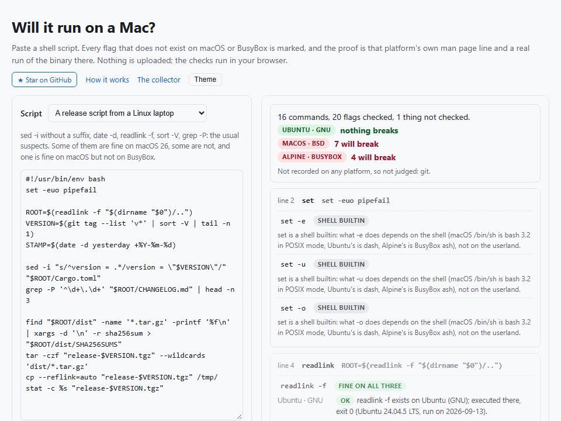

<h1 align="center">Will it run on a Mac?</h1>

<p align="center"><b>Paste a shell script. Every flag that does not exist on macOS or BusyBox is marked, and the proof is that platform's own man page line and a real run of the binary there.</b><br>Nothing is uploaded; the checks run in your browser.</p>

<p align="center">
  <a href="https://barbarkaragul-oss.github.io/will-it-run-on-a-mac/">Open the checker</a> ·
  <a href="#how-it-works">How it works</a> ·
  <a href="#what-the-runs-showed">What the runs showed</a> ·
  <a href="#limits">Limits</a>
</p>

<p align="center">
  <a href="https://github.com/barbarkaragul-oss/will-it-run-on-a-mac/actions/workflows/ci.yml"></a>
  <a href="https://github.com/barbarkaragul-oss/will-it-run-on-a-mac/actions/workflows/collect.yml"></a>
  
</p>

<p align="center">
  <a href="https://barbarkaragul-oss.github.io/will-it-run-on-a-mac/"></a>
</p>

"Works on my Linux, breaks on my Mac." `sed -i` without a suffix, `date -d yesterday`, `grep -P`, `find -printf`, `xargs -d`, `cp --reflink`, `stat -c`, `timeout`: the same dozen flags have broken macOS and Alpine CI jobs for fifteen years. ShellCheck has been asked to warn about them since 2015 ([#479](https://github.com/koalaman/shellcheck/issues/479), [#973](https://github.com/koalaman/shellcheck/issues/973), [#1455](https://github.com/koalaman/shellcheck/issues/1455), [#2902](https://github.com/koalaman/shellcheck/issues/2902)); its maintainer's answer was that ShellCheck knows which *shell* you target, not which *userland*, and that somebody would have to maintain the list. Nobody wanted to maintain the list by hand. This page does not: the list is measured.

```
sed -i 's/foo/bar/' config.txt
  Ubuntu · GNU      ok       sed -i exists; argument optional here; executed there
  macOS · BSD       ok       sed -i exists; takes a required argument here; executed there
                             mdoc: .Op Fl i Ar extension      ← so 's/foo/bar/' becomes the backup suffix
date -d yesterday
  macOS · BSD       breaks   the binary answered "date: illegal option -- d" (macOS 26.6.2, run on 2026-09-12)
uniq -D hosts.txt
  macOS · BSD       ok       executed there, exit 0            ← the folklore says macOS has no -D; macOS 26 does
  Alpine · BusyBox  breaks   "uniq: unrecognized option: D"
```

## What it does

- **Parses the script for real.** [tree-sitter-bash](https://github.com/tree-sitter/tree-sitter-bash) finds every simple command: inside pipelines, `&&` chains, subshells, functions, loops, `$(...)`, and unquoted heredocs. Quoted heredoc bodies stay inert.
- **Unwraps what runs what.** `sudo`, `env`, `nohup`, `nice`, `timeout`, `xargs CMD`, `find -exec CMD`, `sh -c '...'` with a static string: the inner command is checked, and the wrapper's own flags too.
- **Splits flags the way the tool would.** `-rf` is `-r` and `-f`; `-n5` is `-n` with a value when the tool says `-n` takes one; `--in-place=.bak` is `--in-place`; everything after `--` is an operand; `tar xvf` and `ps aux` are noted as old-style bundles, not judged.
- **Judges each flag on each platform**, in this order of trust: a real execution of the flag on that platform, then a recorded scenario that used it, then the platform's documentation, and when there is none, *unknown*. Shell builtins (`echo -e`, `set -o`) are marked as depending on the shell, not the userland. A tool that does not exist on a platform (`timeout`, `tac`, `nproc` on macOS) is a break by itself.
- **Judges shell constructs under the interpreter that will actually run them.** Arrays, `${x,,}`, `[[ ]]`, `(( ))`, `<( )`, `<<<`, `mapfile`, `read -p`, an unquoted `$var`, a glob that matches nothing, `cmd | read v`, `set -o pipefail`, `echo -e`, `local`, `function f`: 142 constructs (143 one-liners; one only prints the shell's version), chosen by scanning 2,905 real scripts for what they actually use. The shebang decides the interpreter on each platform (`#!/bin/bash` is bash 3.2 on macOS; `#!/bin/sh` is dash on Ubuntu, bash-as-sh on macOS and BusyBox ash on Alpine; no shebang means the default interactive shell, which is zsh on a Mac), a selector overrides it, and every construct is compared with the recorded run under bash 5.2 on Ubuntu: *same*, *differs* (both run, print different things) or *breaks* (bash runs it, this shell errors).
- **Refuses to guess.** `$OPTS`, `"$@"`, `${FLAGS}` and a dynamic command name are reported as not checked. Nothing is expanded.
- **Shows its evidence.** Every verdict expands to the `--help` or man page line and the exact command that was executed, with its exit code and first line of stderr, and the platform version and date it was recorded on.

## How it works

Nothing in the flag database is written by hand. [`collector/`](collector/) is a GitHub Actions matrix, run weekly, on **ubuntu-latest** (Ubuntu 24.04, GNU coreutils 9.4), **macos-latest** (macOS 26.6, the BSD userland) and an **alpine:3.20** container (BusyBox 1.36). On each platform it records, for 80 common tools:

| Step | What is recorded |
|---|---|
| [`collect.sh`](collector/collect.sh) | `--help` output, the usage line a BSD tool prints on an unknown option, the rendered man page and its mdoc source |
| [`probe.sh`](collector/probe.sh) | 87 scenario commands (`sed -i 's/a/b/' f`, `date -d yesterday`, `find . -printf`, …) with exit code, first stderr line and first stdout line |
| [`shells/probe-shells.sh`](collector/shells/probe-shells.sh) | the 143 one-liners in [`shells/probes.txt`](collector/shells/probes.txt) (142 constructs and a version check), each run as a one-line script under every shell the platform has (Ubuntu: bash 5.2, dash as `sh`, dash, zsh, ksh93; macOS: bash 3.2, bash-as-`sh`, zsh, ksh93; Alpine: BusyBox `sh`/ash, bash, zsh, dash), 14 interpreters, with exit code, first stdout line and first stderr line |
| [`probe-all.sh`](collector/probe-all.sh) | **every short flag** `-a`…`-z`, `-A`…`-Z`, `-0`…`-9` and **every long option any platform documents**, executed with and without an operand file; the answer is classified as *rejected* or *recognized* by comparing it with the tool's own unknown-option wording, learned from two canary invocations (`-~` and `--wiroam-no-such-option`); plus **every `find` primary** in [`find-primaries.txt`](collector/find-primaries.txt), executed after a path (`find . -newermt 2020-01-01`) and classified by a third canary (`find . -wiroamnosuch`) |

That is about 11,000 executions per platform per week. [`scripts/extract.ts`](scripts/extract.ts) turns the recordings into [`data/flags.json`](data/flags.json): per tool and platform, every documented flag with the verbatim line that documents it and its arity, every executed flag with its result, and the tool's version and path. [`scripts/extract-shells.ts`](scripts/extract-shells.ts) does the same for the shell recordings: [`data/shells.json`](data/shells.json) is 143 probes × 14 interpreters = 2,002 results. The site loads one small file per tool. The weekly run commits the new database, so a flag that appears in a macOS release shows up as *ok* the next Monday, with the date.

"Recognized" is deliberately weak: it means the binary did not reject the option, not that it does the same thing. `stat -f` exists on both GNU and BSD and means different things; the page shows both platforms' evidence lines side by side and leaves the semantics to you.

## What the runs showed

Things the recordings pinned down that the cheat sheets get wrong or do not say:

- **macOS 26 has more GNU-style flags than folklore claims.** `readlink -f`, `realpath`, `sort -V`, `sort -h`, `uniq -D`, `wc -L`, `date -Iseconds`, `ls --color` all ran with exit 0 on the macOS runner. The lists that say otherwise were true in 2015.
- **The classic breaks are still breaks.** `sed -i` without a suffix (macOS takes `'s/foo/bar/'` as the backup extension and then fails on the file name), `sed -z`, `grep -P`, `date -d`, `stat -c`, `find -printf`, `xargs -d`, `head -n -1`, `du -b`, `base64 -w`, `cp --reflink`, `cp -u`, `ln -r`, `tar --wildcards`, `touch -d`, `install -D`: all rejected on macOS 26, with the binary's own message recorded. `timeout`, `tac` and `nproc` are not there at all.
- **`find` primaries, measured the same way** (86 of them, executed after a path). macOS 26 rejects `-printf`, `-fprintf`, `-fprint`, `-fprint0`, `-fls`, `-regextype`, `-xtype`, `-readable`, `-writable`, `-executable`, `-used`, `-daystart`, `-warn`/`-nowarn`; it accepts `-newermt`, `-samefile`, `-uid`/`-gid`, `-wholename`, `-delete`, `-quit`, `-execdir`, `-okdir`. BusyBox rejects 50 of the 86, among them `-newermt` and every other `-newerXY`, `-anewer`/`-cnewer`, `-amin`/`-cmin`, `-iregex`, `-lname`, `-samefile`, `-uid`/`-gid`, `-fstype`, `-true`/`-false`, `-ls`, `-printf`, `-execdir`, `-ok`; it accepts `-delete`, `-print0`, `-regex`, `-empty`, `-quit` and `-wholename`. GNU rejects only the BSD ones (`-Btime`, `-Bnewer`, `-flags`, `-acl`, `-xattr`), and `-newerBt` exists but answers "This system does not provide a way to find the birth time of a file".
- **BusyBox is its own island.** `uniq -D`, `split -d`, `ls -G`, `rm -I`, `mktemp -t`, `base64 -b`, `which -s`, `date -v` are rejected on Alpine; `date -d` exists there but does not understand `yesterday`.
- **Documentation and binaries disagree.** macOS's date(1) man page still documents `-d`; the binary answers `illegal option -- d`. BusyBox accepts `cp --reflink`, `grep --color` and `od -A` that its usage text never mentions. This is why a run outranks a man page here.
- **zsh is not bash with a different prompt.** Under zsh 5.9 on the macOS runner (the macOS default shell since Catalina; the Linux runners carry the same version), 28 of the 142 constructs that bash 5.2 runs are errors: a glob that matches nothing (`for f in *.tmp` stops with `no matches found`), `[ a == a ]`, `${x,,}`, `${x^^}`, `${!name}`, `${!arr[@]}`, `mapfile`, `read -p`, `read -a`, `read -n`, `read -N`, `shopt` with any option, `declare -n`, `${x@Q}`, `${x@U}`, `$EPOCHSECONDS`, `type -t`, `type -P`, `compgen`, `complete`, `caller`, `wait -n`, `printf '%(%Y)T'`, and `;;&` in a `case`. Nineteen more run and print something else: `${arr[1]}` is the first element (zsh arrays start at 1), and so are `${arr[$i]}` and the element you read back after `arr+=(x)`; an unquoted `$var` is one word, not three, and `IFS` does not split it either; `echo x | read v` keeps `v` (the last command of a pipe is not a subshell); `echo 'a\tb'` prints a tab where bash prints the backslash; `$((010))` is 10, not 8; `${PIPESTATUS[@]}`, `$FUNCNAME`, `${BASH_REMATCH[1]}` and `$HOSTNAME` are unset; a `trap ... EXIT` set inside a function fires when the function returns, not when the script ends; `unset arr[1]` leaves three elements; `local` outside a function is allowed; `declare -p x` prints `typeset x=hi`; `declare -F f` prints nothing; `export -f` is accepted and prints the function, as `typeset -f` would. The Linux builds of the same zsh 5.9 reject `export -f` instead; it is the only row where the three zsh runs differ. ShellCheck [does not target zsh](https://github.com/koalaman/shellcheck/issues/809); this is the measured list.
- **bash 3.2 on macOS** (the `/bin/bash` Apple ships) refuses 21 of the 142: `${x,,}`, `${x^^}`, `${x@Q}`, `${x@U}`, `declare -A`, `declare -n`, `declare -g`, `mapfile`, `[[ -v x ]]`, `$EPOCHSECONDS`, `coproc`, `;&` and `;;&` in a `case`, `|&`, `printf '%(%Y)T'`, `wait -n`, `read -N`, `${x:1:-1}` (a negative length), `"${arr[@]}"` of an empty array under `set -u` (`arr[@]: unbound variable`, the reason for the `${arr[@]+"${arr[@]}"}` idiom), `shopt -s globstar`, `caller`. `${arr[-1]}` is not an error there: it prints nothing. Every other construct printed what bash 5.2 printed.
- **`#!/bin/sh` is three different shells.** dash 0.5.12 (Ubuntu's `sh`) errors on 83 of the 142 constructs, BusyBox ash 1.36.1 (Alpine's) on 57, and macOS's `sh` is bash 3.2 in POSIX mode, which errors on 22. A script that passes under one `sh` has been tested under one `sh`.
- **`date +%N` is not an error, it is wrong.** The macOS binary exits 0 and prints a literal `N`; exit codes alone would have called it fine. Scenario probes record the first line of output for that reason.

## Run it locally

```bash
git clone https://github.com/barbarkaragul-oss/will-it-run-on-a-mac && cd will-it-run-on-a-mac
npm install
npm test                    # extractors on real recordings, verdicts, shell constructs, end-to-end script analysis
npx tsx scripts/build.ts    # docs/ (the static site; serve it with any static server)
```

To re-record: fork, run the **collect** workflow (Actions → collect → Run workflow), download the three artifacts into `out/`, and run `npx tsx scripts/extract.ts`. To add a tool, add it to [`collector/tools.txt`](collector/tools.txt) (and to [`probe-tools.txt`](collector/probe-tools.txt) if it is safe to run with arbitrary flags in a temporary directory).

**Corpus behind the probe list.** The shell constructs in [`collector/shells/probes.txt`](collector/shells/probes.txt) were chosen by counting what real, widely run bash scripts use. The repositories are listed in [`collector/shells/corpus.txt`](collector/shells/corpus.txt) as `owner/repo`, with an optional `@ref` suffix naming a tag to check out; clone them into one directory and scan it:

```bash
mkdir -p corpus
for r in $(grep -v '^#' collector/shells/corpus.txt); do
  repo=${r%@*}; ref=${r#*@}; dir="corpus/${repo//\//__}"
  if [ "$ref" != "$r" ]; then git clone --depth 1 --branch "$ref" "https://github.com/$repo" "$dir"; else git clone --depth 1 "https://github.com/$repo" "$dir"; fi
done
npx tsx scripts/corpus-scan.ts corpus corpus-report.json
```

The report counts, per construct, how many scripts use it at least once and which ones the probes already measure; a construct many scripts use that no probe covers is a candidate for the next probe. Repositories whose scripts are all zsh (ohmyzsh) contribute nothing to the count: the scanner skips zsh files and only reports how many it skipped.

## Limits

- **Existence, not semantics.** A flag can exist on two platforms and behave differently; the evidence lines are shown, the meaning is not compared.
- **Dynamic words are not checked.** No variable expansion, no `eval`, no `$(which sed)`.
- **`find` is an expression language.** Its primaries (`-name`, `-printf`, `-newermt`, …) are not read from the man pages; each one in [`find-primaries.txt`](collector/find-primaries.txt) is executed after a path on every platform and judged by that run alone. A primary not in that list is noted, not guessed.
- **Shell constructs are matched by shape, not simulated.** The 142 constructs are recognized in the parse tree; the verdict is the recorded run of that construct's own one-liner under the interpreter, not a run of your line. A construct outside the list is not mentioned. The list is not a specification: it is every construct used by at least 2.5% of 2,905 scripts from 28 widely run repositories ([`collector/shells/corpus.txt`](collector/shells/corpus.txt), counted by [`scripts/corpus-scan.ts`](scripts/corpus-scan.ts)), plus the well-known differences; `<<-` heredocs cannot be a one-liner and are not probed. The three interpreters judged are the ones the shebang reaches (`bash`, `sh`, `zsh`, or the platform default when there is none); ksh and dash-on-Alpine are recorded but not shown.
- **Old-style bundles** (`tar xvf`, `ps aux`) and key=value tools (`dd if=`) are noted, not judged.
- **The shell is measured as shipped, not as configured.** Every probe runs with the shell's own startup files disabled (`zsh -d -f`, and `$ENV`/`$BASH_ENV` removed from the environment). `/etc/zshenv` is read by zsh whatever the flags say, so which startup files existed on the runner is recorded next to the results in `out/<platform>/_shellfiles.tsv`. A `setopt` of your own (`shwordsplit`, `ksharrays`, `nonomatch` in `~/.zshenv`, which is read by scripts even though `~/.zshrc` is not) changes what your script does and is not in this data.
- **Three platforms, one version each**, whatever the GitHub runner image is that week. FreeBSD, older macOS and other BusyBox builds are not recorded.
- **Network and process tools** (`curl`, `wget`, `ssh`, `rsync`, `kill`, `pkill`) are documented but not exhaustively executed.

Wrong verdict? [Open an issue](https://github.com/barbarkaragul-oss/will-it-run-on-a-mac/issues/new) with the command and the platform; if a real run disagrees with the page, the run wins and becomes a probe.

## License

MIT. The recordings are the output of the platforms' own tools; tree-sitter and tree-sitter-bash are MIT.
